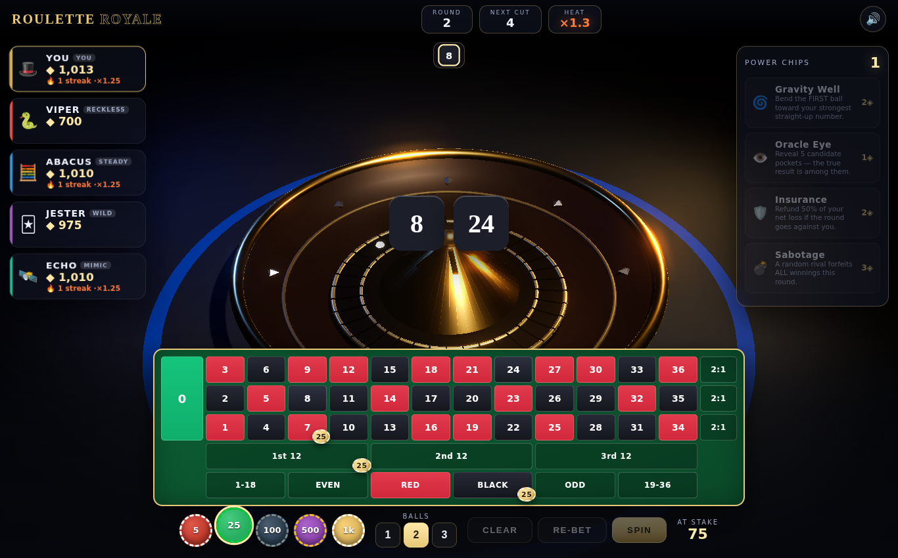

# 🎯 ROULETTE ROYALE — Last Spin Standing

A fully 3D, browser-based roulette game with a strategic twist stack: **multi-ball
variance betting, a heat-streak multiplier, a power-chip ability economy, and a
battle-royale elimination format against four AI opponents** — each with its own
personality.

Built with **Three.js** (vendored locally, no internet required) and vanilla
JavaScript modules. Just open `index.html`.



## ▶️ How to run

**Just double-click `index.html`.** That's it.

No server, no build step, no install, no internet connection. `index.html` is a
single fully self-contained file — Three.js, all game code, and all styles are
inlined — so it runs straight from the `file://` protocol in any modern browser.

> The only thing that needs the network is the optional Google Fonts link; if
> you're offline the game falls back to system fonts and plays identically.

## 🎲 The Twist

This is not basic roulette. Four interlocking systems make every spin a decision:

| System | What it does |
| --- | --- |
| **🎯 Multi-Ball** | Spin **1–3 balls** at once. Each ball is an independent draw, and your bet pays its *share* across the balls — so more balls means steadier but smaller payouts, while a single ball is high-risk/high-reward. Choosing your ball count is a genuine variance dial. |
| **🔥 Heat Streak** | Win consecutive rounds to stack a payout multiplier up to **×3.0**. A single losing round resets it to zero. |
| **⚡ Power Chips** | Earn Power Chips (◈) by hitting straight-up numbers and building streaks, then spend them on abilities (below). |
| **💀 Battle Royale** | You + 4 AI sharks start with 1000 chips. Every **5 rounds** the lowest stack is **eliminated**. Bust to zero and you're out. Be the Last Spin Standing. |

### Power abilities

| Power | Cost | Effect |
| --- | --- | --- |
| 🌀 **Gravity Well** | 2◈ | Bends the first ball toward your strongest straight-up number. |
| 👁️ **Oracle Eye** | 1◈ | Reveals five candidate pockets — the true result is guaranteed to be among them. |
| 🛡️ **Insurance** | 2◈ | Refunds 50% of your net loss if the round goes against you. |
| 💣 **Sabotage** | 3◈ | A random rival forfeits **all** of their winnings this round. |

### The opponents

- **🐍 VIPER** — *reckless*: high-variance, loves straight-up numbers.
- **🧮 ABACUS** — *steady*: risk-averse, spreads small even-money bets.
- **🃏 JESTER** — *wild*: pure chaos, occasionally goes all-in.
- **🛰️ ECHO** — *mimic*: copies your bets with a twist.

## 🕹️ Controls

- **Left-click** a felt cell to place the selected chip; **right-click** to remove.
- Pick your chip denomination on the rail, and **1 / 2 / 3** balls before spinning.
- **Drag** to orbit the camera; **scroll** to zoom.
- **RE-BET** repeats your last wager; **CLEAR** wipes the table.

## 🗂️ Project structure

```
index.html              # ← THE GAME: single self-contained build (just open it)

index.src.html          # modular dev source (needs a server; ES modules)
build.mjs               # bundles the source into the single-file index.html
css/styles.css          # casino-neon / glassmorphism UI
js/
  data.js               # wheel layout, colours, payouts, bots, powers
  state.js              # single source of truth
  three-scene.js        # renderer, camera, lights, bloom post-processing
  wheel.js              # 3D wheel + ball physics + spin animation
  betting.js            # felt betting board + wager handling
  bots.js               # AI opponent "brains"
  game.js               # round resolution: payouts, heat, powers, eliminations
  powers.js             # power-chip abilities
  audio.js              # synthesised WebAudio sound (no asset files)
  ui.js                 # HUD: player cards, powers, history, toasts, banners
  main.js               # boot, render loop, round lifecycle
  vendor/               # Three.js (vendored for offline builds)
```

### Rebuilding `index.html`

The shipped `index.html` is generated from the modular source. To rebuild after
editing anything in `js/` or `css/`:

```bash
npm i -D esbuild     # one-time
node build.mjs       # regenerates the self-contained index.html
```

`build.mjs` resolves Three.js from `js/vendor/`, so the build runs offline too.

## 🛠️ Tech notes

- The spin animation is **wall-clock driven**, so it always lasts ~6 seconds
  regardless of frame rate — no slow-motion on low-end devices.
- The winning pocket is decided up front; the wheel then animates to land the
  ball(s) exactly on the result, with the rotor and ball counter-rotating, an
  inward spiral, and damped bounces across the frets.
- All sound is synthesised at runtime via the Web Audio API — there are no
  external audio or image assets to download.
